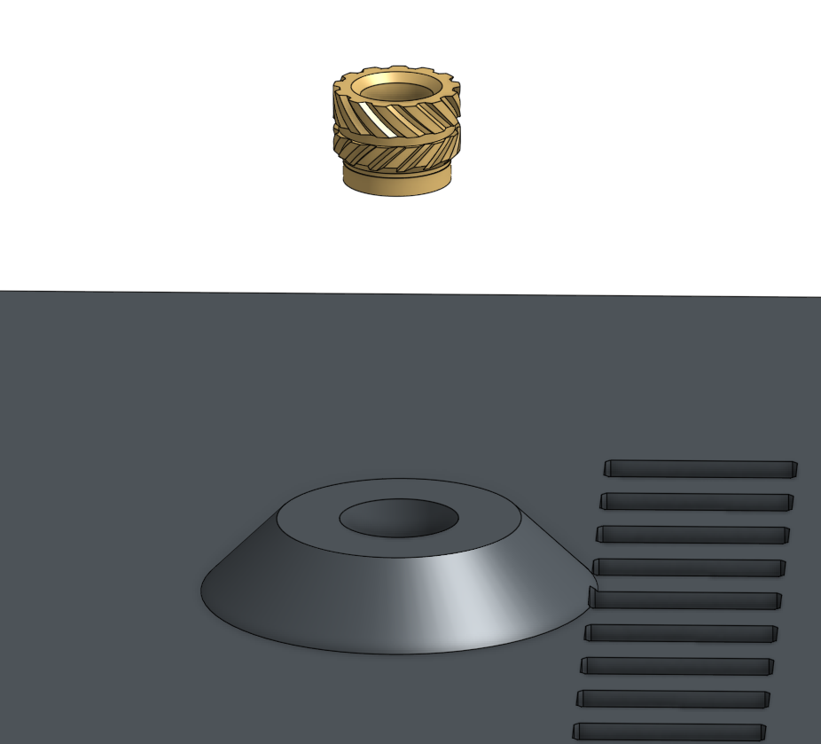
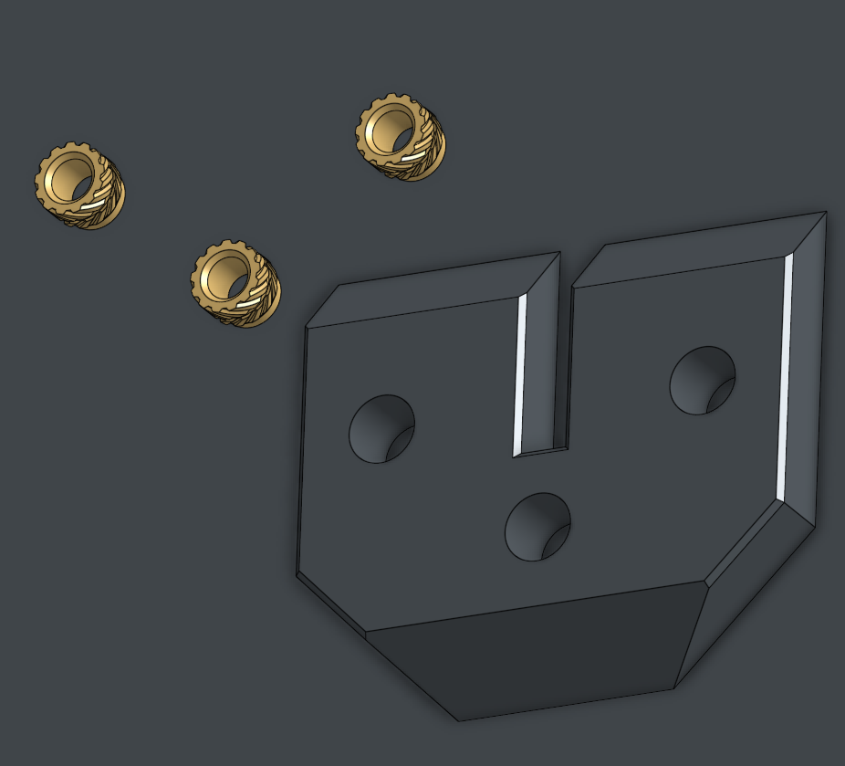
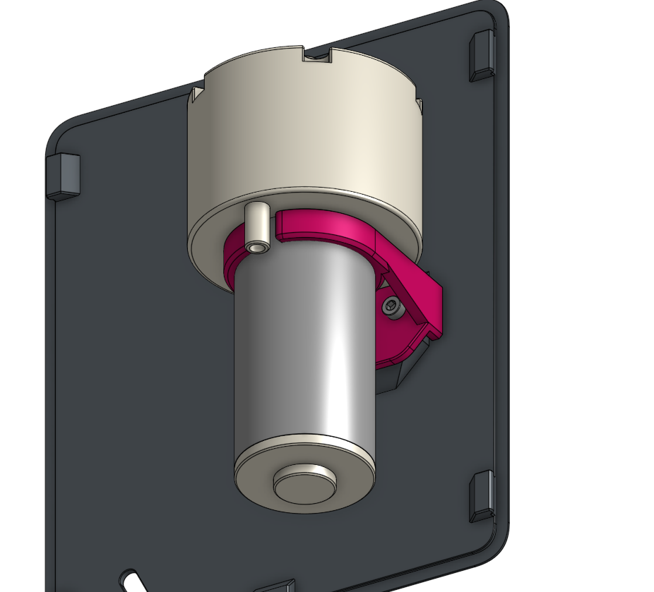
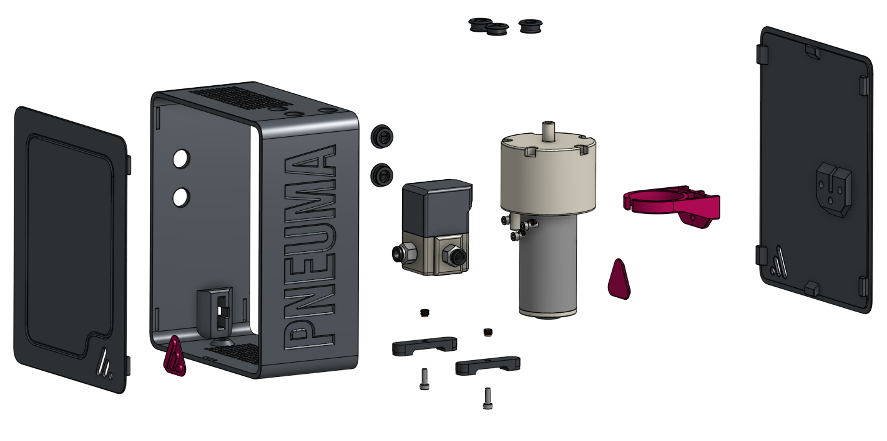
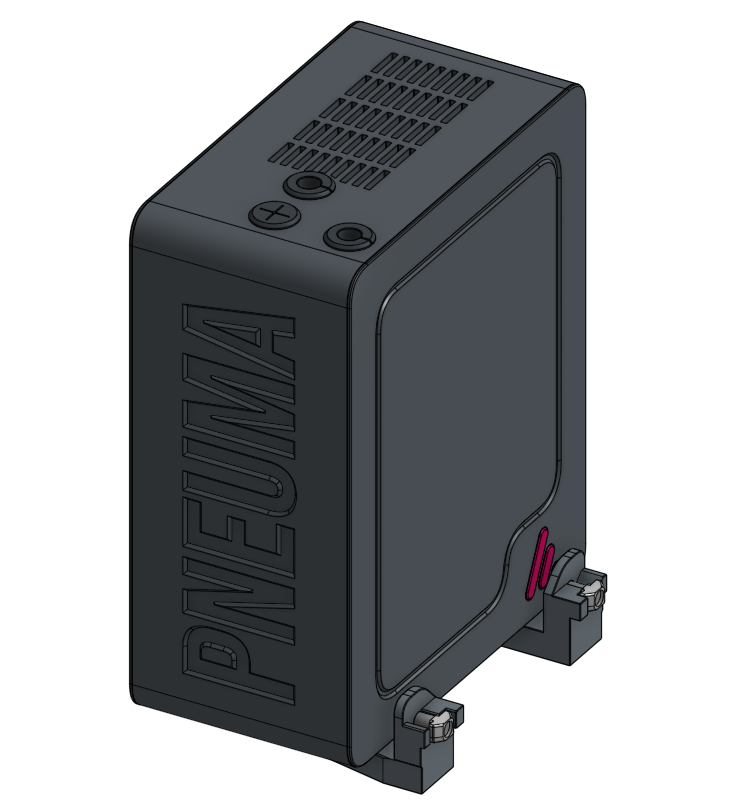
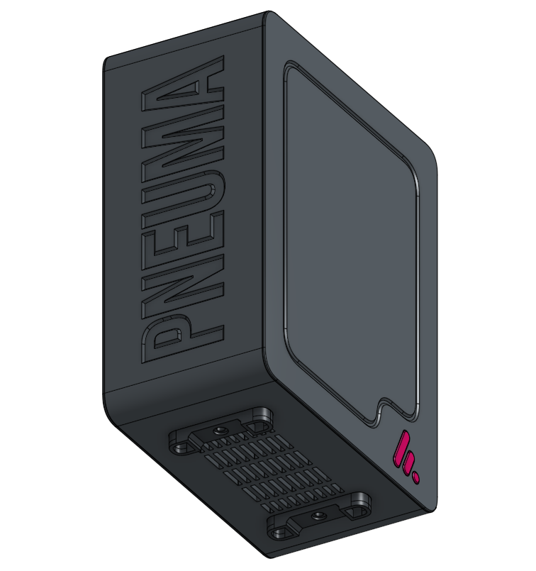

# 🛠️ Assembly Guide

Welcome to the assembly guide for the Pneuma Part Cooling system.

> [!NOTE]
> **Dual-Pump Architecture**
>
> Pneuma has recently been upgraded to a dual-pump system (removing the previous direct-acting solenoid valve). This allows for independent, granular control over ambient room air and warm internal chamber air.  It also means this assembly guide has changed, but the core principals remain.  This will be updated at a later date.

## Tools Required
- Hex keys
- Flush cutters
- Tube cutter
- Soldering iron (for heat set inserts)

### Note
> [!WARNING]
> **Builder Responsibility**
>
> This is an aftermarket engineering project. You are solely responsible for your own safety and the integrity of your equipment when building and operating this system. By utilizing these files and instructions, you accept all liability.

---

## Step 1: Heat Set Inserts

Begin by installing the M3 heat set inserts into the printed parts. Ensure they are flush with the surface to allow for proper mating of the components.

  
  

 
*Fig. 1: Install M3 inserts into the Main Body and Rear Cover.*

---

## Step 2: Pump Mounting

Attach the vacuum pump to the pump mount using the appropriate screws. Ensure the pump is seated securely.

 
*Fig. 2: Secure the pump to the Pump Mount.*

---

## Step 3: Main Assembly

Bring together the main components. Route the pneumatic tubing and any necessary wiring through the designated channels before closing the covers.

> [!NOTE]
> **Threaded Fittings**
>
> Teflon tape is recommended at a minimum on the pressure side of the line when using threaded fittings.

> [!NOTE]
> **Solenoid Valve Routing**
>
> Typical direct action solenoid valves will have a common outlet, and two switching outlets. The common outlet must go to the pump intake, and for ABS/ASA and higher tier filament machines, it is recommended to have at least one line draw from the chamber to ensure warmer air is an option to avoid warping.

> [!WARNING]
> **Tubing Bend Radius**
>
> Take care when routing the pneumatic tubing. Avoid sharp bends and do not exceed the minimum bend radius of your tubing. Kinked lines will severely restrict airflow and reduce cooling system performance.

 
*Fig. 3: Exploded view of the primary Pneuma assembly.*

---

## Step 4: Optional Mounting Solutions

Depending on your setup, you can mount the Pneuma system either to the printer's aluminum extrusion or directly to a table/enclosure surface. 

  
  

 
*Fig. 4: Optional Extrusion mount (left) and Table mount (right).*

---

### End of Assembly
The Pneuma Part Cooling system is now assembled and ready for integration!

***

> ☕ **Did you find this guide helpful?** 
> 
> My projects are open-source and free for the community. If you've enjoyed my designs and want to support my work, consider [leaving me a tip on Ko-fi](https://ko-fi.com/alchemical3d)! 
>
> 
